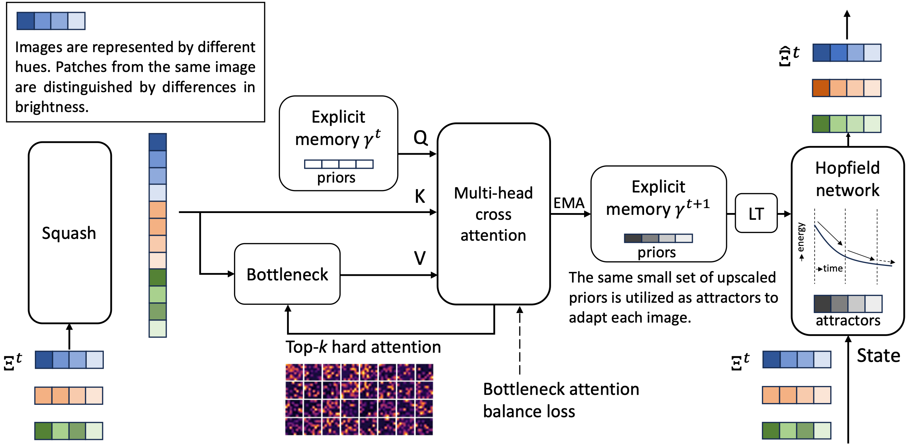

# Associative Transformer
[](https://github.com/yaoyao-liu/class-incremental-learning/blob/master/LICENSE) [](https://www.python.org/) [](https://pytorch.org/) [](https://awesome.re)

The code repository for "Associative Transformer Is A Sparse Representation Learner" [paper](https://arxiv.org/abs/2309.12862) (NeurIPS23 workshop) in PyTorch. 

Associative Transformer (**AiT**) enhances ViT and sparse attention-based models such as the Coordination and Perceiver, building upon neuroscience studies of associative memory.

<p align="center">

</p>


## Training

### AiT on CIFAR10
      python ait.py

### Customized Settings (refer to the paper)
      python ait.py --warmup_t $warmup_t --beta $beta --pattern_size $pattern_size --memory_dim $memory_dim --bottleneck $bottleneck --dataset $dataset --epochs $epochs --batch_size $batch_size --patch_size $patch_size --model_size $model_size

## Citation
If this repository is helpful for your research or you want to refer the provided results in this work, you could cite the work using the following BibTeX entry:

```
@article{sun2023associative,
  author = {Yuwei Sun, Hideya Ochiai, Zhirong Wu, Stephen Lin, Ryota Kanai},
  title = {Associative Transformer is a Sparse Representation Learner},
  journal = {arXiv preprint:2309.12862},
  year = {2023}
}
```
